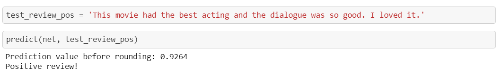

# Sentiment analysis with RNN

## Project overview

The aim of the project is to implement a recurrent neural network, long short term memory (LSTM), that is able to classify a movie review, into negative or positive. The data used was the IMDB dataset which contains 25,000 reviews. 

 

The project involves:

* Text processing: normalize and cleaning text
* Feature extraction: word2vec algorithm
* Model: LSTM neural network

The arquitecture of the network is composed of: one `embedding` layer, two layers of `lstm`, a `fully-connected` layer and finally a sigmoid output layer to  predict sentiment values between 0-1.

The model reached 83% accuracy in the test data.

#### Technologies used:

* Python, pytorch, numpy
* Neural networks 
* RNN, LSTM

## Hyperparameters

The final hyperparameters were:

| Hyperparameters  | Value | 
| -------------- | --------- |
| epoch            | 5       | 
| learning rate    | 0.001   | 
| batch_size       | 50      | 
| sequence_length  | 200     | 
| embedding_dim    | 400     | 
| hidden_dim       | 256     | 
| n_layers         | 2       | 

In order to improve the model the parameters can be changed.

## Installation

Using [Anaconda](https://www.anaconda.com/products/individual), in an enviroment with python 3, install the following packages:
```
conda install jupyter, numpy 
conda install -c pytorch pytorch
```
