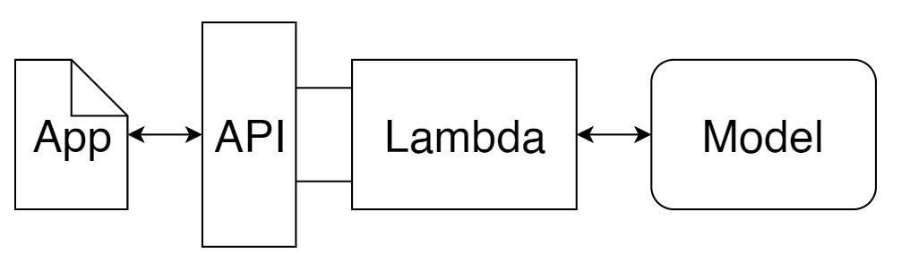
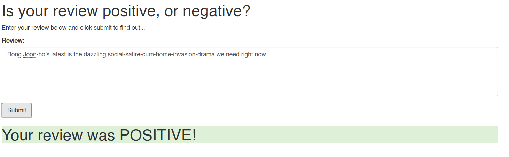

# Sentiment analysis Web App

## Project overview

The aim of the project is to deploy a recurrent neural network (LSTM) that performs sentiment analysis on movie reviews using AWS SageMaker. The data used was the IMDB dataset which contains 25,000 reviews.

 

The project involves:

* Preprocessing the data and uploading it to S3
* Training and testing the model
* Deploying the model 
* Creating Lambda function and setting up a API Gateway 
* Deploying the web app

#### Technologies used:

* Python, pytorch, numpy
* Neural netowrks: RNN (LSTM)
* AWS SageMaker

## Web app

The final result is a simple web like this:

 

## Installations

1. Create a notebook instance inside SageMaker. Use `ml.t2.medium` as notebook instance type.

2. Inside the notebook open New->Terminal and clone this repository:

```
git clone https://github.com/HannaLAguilar/Sentiment_analysis_Web
```

3. Run the SageMaker.ipynb notebook.

In this repository, you can find the following files and folders:

* `train`: files used by SageMaker to train the RNN.
* `serve`: files used by SageMaker to inference the result or a review (postive or negative)
* `website`: contains a simple HTML file which works as our web app. If you open index.html on your local computer, your browser will behave as a local web server and you can use the provided site to interact with your SageMaker model.
