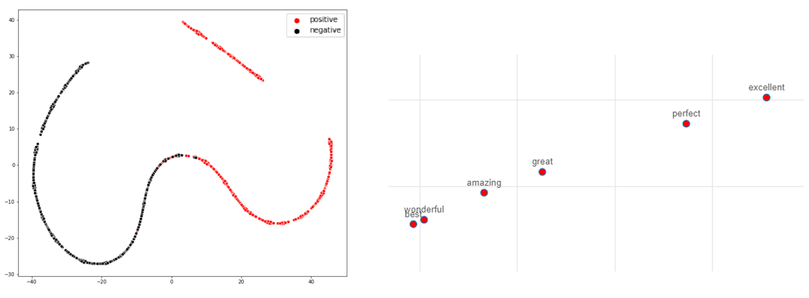

# Sentiment Analysis

This project is based on instructions by Andrew Trask for the [Deep Learning Udacity Nanodegree](https://github.com/HannaLAguilar/Deep-Learning_Udacity)

## Project overview

The aim of the project is to implement a neural network that is able to classify a movie review, into negative or positive. The data used was the IMDB dataset which contains 25,000 reviews. The general idea is to create a base neural networks model and improve it in order to have better results in accuracy and training speed.

The notebook is divided into 4 models and a final section that analyzes the weights of neural networks:

* Model 1: base neural networks model
* Model 2: reducing noise in our input data (increases accuracy)
* Model 3: eliminating unnecessary matrix multiplications (reduces training time) 
* Model 4: reducing unnecessary vocabulary (reduces training time) 
* Analysis: what's going on in the weights?

#### Technologies used:

* Python, numpy
* Neural networks 
* sklearn TSNE, matplotlib, seaborn
* jupyter notebook, anaconda
 
 ## Summary of results
 
 #### Models

| Model | Test accuracy (%)| Training Speed (reviews/sec)|
| --- | -------------- |---------------------------|
| 1     | 74.7              | 130                         |
| 2     | 86.0              | 135                         |
| 3     | 86.0              | 1500                        |
| 4 (A) | 85.1              | 2000                        |
| 4 (B) | 82.9              | 7000                        |

(A): polarity_cutoff = 0.05, (B): polarity_cutoff = 0.80

#### Word similarity visualization

Analyzing the weights of the neural networks, we can see that words in positive reviews formed a cluster and words in negative reviews formed another cluster. Besides, semantically similar words tend to appear together. 

 

## Installation

Using [Anaconda](https://www.anaconda.com/products/individual), in an enviroment with python 3, install the following packages:
```
conda install jupyter, numpy, matplotlib, seaborn 
conda install -c anaconda scikit-learn
```
